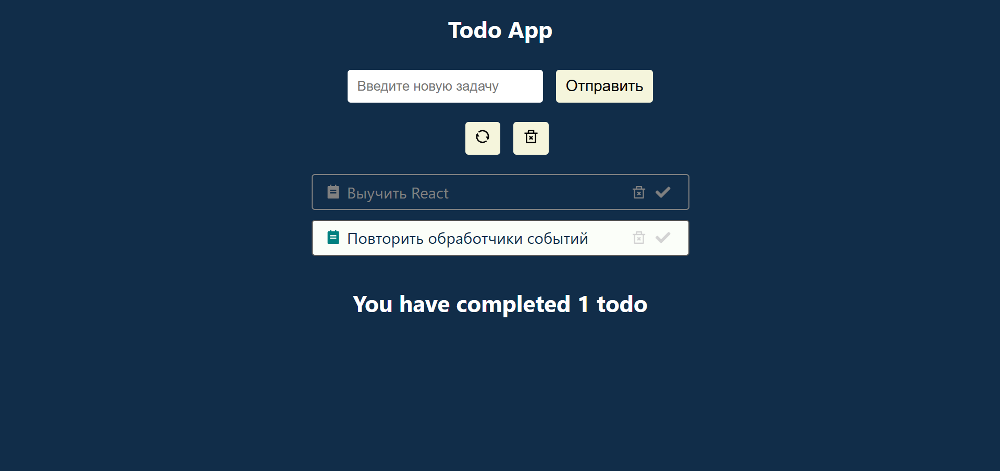

## Структура проекта

todo-app/
│
├── public/ # Статические файлы
│ ├── favicon.ico # Иконка приложения
│ ├── index.html # Основной HTML-шаблон
│ └── pwa-assets/ # Файлы для PWA
│ ├── android-chrome-\*.png
│ └── site.webmanifest
│
├── src/ # Исходный код
│ ├── components/ # React-компоненты
│ │ ├── TaskList/ # Список задач
│ │ │ ├── index.jsx
│ │ │ └── styles.css
│ │ └── AddTask/ # Форма добавления
│ │
│ ├── utils/ # Вспомогательные функции
│ │ └── storage.js # Работа с localStorage
│ │
│ ├── assets/ # Ресурсы
│ │ └── react.svg # Логотип React
│ │
│ ├── App.jsx # Корневой компонент
│ ├── main.jsx # Точка входа
│ └── index.css # Глобальные стили
│
├── vite.config.js # Конфигурация Vite
├── .eslintrc.json # Настройки ESLint
├── .gitignore # Игнорируемые файлы
│
├── package.json # Зависимости
└── package-lock.json # Точные версии

=======

# ToDo App (Vite + React)



## О проекте

Простое и удобное приложение для управления задачами (функционал добавления, удаления задач, очистки списка задач, отметка о выполнении)

---

## Технологии

- Vite 7
- React 19 (хуки)
- CSS модули

---

## Установка

```bash
git clone https://github.com/NikRNN/Todo-App.git
cd todo-vite
npm install
npm run dev
```
